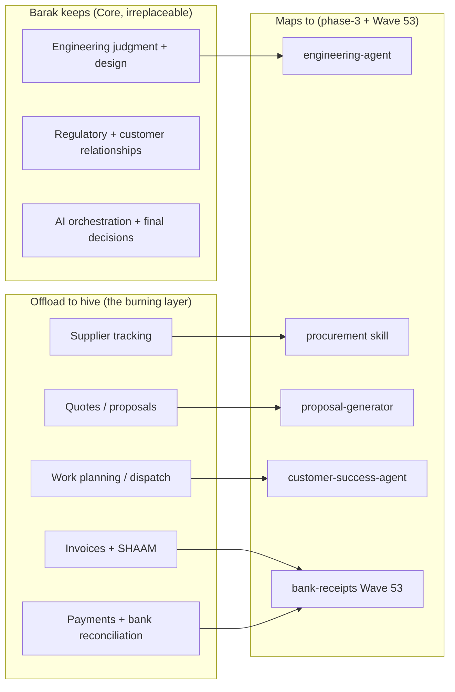

# Barak Barzel — Skills Audit & Master Competency Map

> Synthesized 2026-06-15 from a 7-question sequential audit + everything observed across the BEE hive build (60+ commits, this session). Stored per `protocol_hive.md` §6. This is the canonical self-knowledge node — `[[Barak_Skills_Audit]]` in Obsidian.
>
> **Profile in one line:** Licensed electrical *engineer* + solo founder-operator of BEE since 2018 (day one independent), running a MW-scale commercial solar + electrical contracting business (137 customers, 255 sites, 18 vehicles) **single-handedly on the engineering side**, while building an AI "hive" and a custom SaaS to offload the management layer that's currently run בעל-פה (by memory/verbally).

---

## A. Core Skills (the irreplaceable human layer)

### A1. Electrical & PV Engineering — **expert, native, the moat**
- **Formal:** Electrical Engineer (מהנדס חשמל), registered engineer's license. Operates as electrical inspector (בודק) under his mother's license — she co-signs — until his own license arrives ~2027.
- **Does personally, end-to-end, for every project** (audit Q2 — "all of it"):
  - PV system design (in **SketchUp**)
  - **All** engineering calculations: string sizing, DC/AC ratio, voltage drop, cable cross-sections, short-circuit, protection coordination, earthing, lightning protection
  - High-voltage / transformers / switchboards / NH fuses
  - Field installation + supervision
  - Testing, insulation tests, thermography, handover docs to רשות החשמל / חח"י
  - Commissioning + inverter setup + remote production-fault troubleshooting (SolarEdge / iSolarCloud / Deye cloud)
- **This is the bottleneck** — only Barak can do this surface today. It's the #1 target for `engineering-agent` (offload the repeatable engineering, keep the judgment).
- **Decision style here:** fast + intuitive. High self-confidence on technical calls.

### A2. Founder-Operator / General Management — **carries it all, mostly verbally**
- Runs sales, project management, customer relations, procurement, team coordination, finance-side — for 137 customers / 255 sites / Neri + Shlomi + ~10 contractors.
- **Most of it is "בעל-פה"** (by memory): customer management, procurement, supplier tracking. This is the structural risk + the biggest automation opportunity. Explicitly wants the AI hive + SaaS to take it over.
- **The burning layer** (audit Q7 — what would change his life if AI took it): **supplier tracking · quotes · work planning · invoices · payments.**

### A3. AI Orchestration & Systems Judgment — **emergent, 2026-grade, under-rated by himself**
- Self-rates prompt engineering "low" — but the *output* contradicts that: a 3-layer hive protocol, agents with L0/L1/L2 trust progression, Mermaid flows with distributed locks, a 60-commit coordinated build. He's **type-B AI engineer**: doesn't hand-write the code, but *directs, validates, and judges* it — and supplies the domain grounding no LLM has.
- Knows what good looks like (idempotency because he's seen duplicate-message spam; bank-correctness because it's his money). The **judgment** is the skill; the code is commodity.
- **Known blind-spot + active mitigation:** full reliance on AI for code means he can't always catch when the AI is wrong (e.g. the Mercantile-not-Hapoalim miss). Mitigation = the protocol's validation circuits + self-tests + healthchecks + a hard "don't guess operator facts" rule. The gap narrows as he learns (he asked to be taught in-line).

### A4. Regulatory & Israeli-Market Domain — **native, the second moat**
- Works against חוק החשמל, רשות החשמל solar regs, חח"י connection procedures, ת"י — knowledge a generic LLM lacks. Being captured into `research/knowledge-base/` so agents inherit it.
- Israeli SMB finance reality: Invoice Maven, SHAAM/חשבוניות-ישראל, מע"מ, works with an external רו"ח.

---

## B. Technical Tools (what's actually in his hands)

### B1. Engineering / design
| Tool | Level | Notes |
|---|---|---|
| **SketchUp** | primary design tool | does all PV layout here |
| Engineering hand-calcs | expert | all of them, himself |
| SolarEdge / iSolarCloud / Deye cloud | operator | commissioning + remote monitoring |
| **Product-certified:** KStar, SolarEdge, ABB, Deye | certified installer | the BEE inverter/ESS fleet |

### B2. Business / ops
| Tool | Use |
|---|---|
| **Monday.com** | CRM-ish (100 boards) — but most tracking is still verbal |
| **Invoice Maven** | invoicing (SHAAM-compliance = open question) |
| **Canva + Word + Excel** | quotes / proposals (no templated engine yet → proposal-generator target) |
| **Mercantile Discount Bank** (code 17) | primary business account → Wave 53 ingestion target |

### B3. AI / dev / infra — **AI-augmented, not native** (audit Q4-Q5: "Claude completes me in everything")
| Tool | Reality |
|---|---|
| Claude Code, OpenClaw (Alfred), Hermes, Cursor, Windsurf, Antigravity, Aider, Codex... | "uses all of them, simply" — orchestrates, leans on Claude to fill gaps + teach in-line |
| TypeScript / Prisma / Postgres / Docker / systemd / Tailscale / Git / PowerShell | runs them via Claude; learning by doing; built a server solo "long ago" |
| **Graphify** (knowledge graph) | live on his machine — 2,180-node graph, labeled |
| **Obsidian** | vault exists (PARA), learning the workflow himself |
| n8n / MCP | planned / built an MCP server long ago |
| **BEE Operations SaaS** | his own: 41 routes, 38 Prisma models, PostgreSQL, Docker, Tailscale, customer portal for some clients |

---

## C. Soft Skills / Complementary Competencies

| Competency | Detail (from audit) |
|---|---|
| **Deep-work stamina** | Works best in long, sustained depth sessions (not short sprints). |
| **Learn-by-doing** | Learns best by *seeing someone do it, then doing it himself* → so the right teaching mode from Claude is **demonstrate + narrate reasoning, then hand over**. He explicitly asked Claude to "think out loud so I learn." |
| **Technical intuition** | Fast, confident, intuitive on anything technical he knows. |
| **Honest self-assessment** | Hesitates + flags uncertainty on unfamiliar ground rather than bluffing — this is *why* he's safe to give autonomy to; he says "I don't know, teach me." |
| **Bias to action / building** | 8 years solo from day one; ships. Prefers building the tool over documenting the problem. |
| **Delegation instinct (emerging)** | Recognizes the verbal-management layer is unsustainable and is deliberately engineering its replacement rather than hiring. |
| **Risk awareness** | The whole hive protocol (anti-loop, locks, validation, no-guessing rule) is him encoding hard-won operational lessons so they don't recur. |

---

## D. The gap map — where AI plugs in (priority by his own "burning" answer)

**Build order implied by the audit** (his burning layer first):
1. **bank-receipts (Wave 53)** — invoices + payments visibility. Already in build (Phase A shipped). ✅ on track.
2. **procurement skill** — supplier tracking (currently 100% verbal). High ROI, not yet speced.
3. **proposal-generator** — quotes out of Canva/Word into a templated engine fed by engineering-agent. Speced.
4. **engineering-agent** — offload repeatable PV engineering. Speced.
5. **customer-success-agent** — work planning / customer management at scale. Speced.

---

## E. 3-year vision (audit Q7)

- **Grow customer count.**
- **Fewer manual hours** (the management layer → hive + SaaS).
- (BEE SaaS as a sellable product to other contractors = plausible extension, not yet a stated goal — `[OPEN]`, ask later.)

---

*Burned 2026-06-15. The one audit answer only Barak could give (soft skills + vision) anchors the whole gap map. Everything else (engineering depth, regulatory, tools) is corroborated by the codebase + KB. Update when his self-assessment or the business shape changes.*
