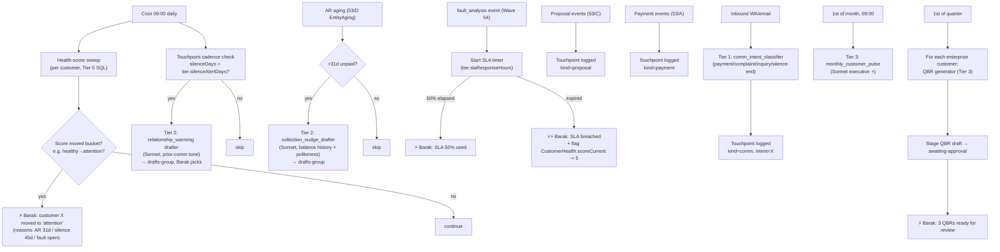

# `[[Customer_Success_Agent_LLD]]` — Wave 55 · Relationship layer

> Sixth LLD under `protocol_hive.md §7`. Wraps the pre-existing `SKILL.md` + `quarterly-review-bee.md` in the canonical §7 shape so the agent is callable from the spine and from Alfred's cron tier. Owns the **customer relationship layer** that sits on top of Wave 53/D's `כרטסות` + Wave 53/C's proposal lifecycle.
>
> **Why separate LLD:** the audit (§A2 + Q3) flags customer-management as 100% verbal today — Barak holds 137 customer relationships in his head. This is fragile + non-scalable. Customer-success-agent is the relationship layer that the spine feeds.

---

## § 1 — Obsidian node header

- **Node:** `[[Customer_Success_Agent_LLD]]`
- **Inbound (callers):**
  - `[[Wave_53_Unified_Data_Spine]]` (parent — relationship consumer)
  - `[[protocol_hive]]` §2 (Tiers), §3.6a (no guessing customer state), §4.2 (validation), §7 (LLD shape)
  - `[[Barak_Skills_Audit]]` §A2 + Q3 — customer mgmt is the burning verbal layer
  - `[[Bank_Receipts_Ingestion_LLD]]` §53/A — payment events
  - `[[Procurement_Tracking_LLD]]` §53/B — supplier delays that affect customer-facing schedules
  - `[[Proposal_Generator_LLD]]` §53/C — proposal lifecycle events (sent / accepted / rejected / expired)
  - `[[Accounting_Ledger_LLD]]` §53/D — AR aging triggers + customer health score
  - `[[Engineering_Agent_LLD]]` Wave 54 — fault_analysis events on customer sites
- **Existing artifacts (referenced, not duplicated):**
  - [`SKILL.md`](SKILL.md) — original agent spec (charter, SLA tiers, 3-sub-skill outline)
  - [`quarterly-review-bee.md`](quarterly-review-bee.md) — QBR template + content rubric
- **Outbound:**
  - WhatsApp self-chat (Alfred drafts group — constitutional law #2 — Barak picks the words)
  - Gmail (for enterprise customers; same gate as proposals — Barak approves)
  - Monday "CRM" board — updates customer status / health columns
  - `[[Cash_Flow_Snapshot]]` — AR collection nudges arrive via this layer

---

## § 2 — Cost / swarm / plugin allocation

### Per sub-skill tier assignment

| Sub-skill | Tier | Engine | Justification |
|---|---|---|---|
| `health_score_calc` (composite per customer) | **0** | SQL aggregation over `EntityBalance` (53/D) + `Proposal` history + payment timeliness + fault count | Pure arithmetic |
| `at_risk_detector` (the daily sweep) | **0** | Threshold rules on health score + AR aging | SQL |
| `touchpoint_cadence_check` (silence > N days for tier X = ⚡) | **0** | SQL — last LedgerEntry / last Proposal / last Comm timestamp per customer | Deterministic |
| `comm_intent_classifier` (incoming WA/email — payment / complaint / inquiry / silence-end) | **1** | DeepSeek flash | Hebrew NLP classification |
| `collection_nudge_drafter` (overdue AR — Hebrew, tone-matched) | **2** | Sonnet | Cognitive — needs prior comm tone + balance history + politeness |
| `qbr_generator` (quarterly business review per enterprise customer) | **3** | Sonnet | Quality matters — this goes to Rafael Solar / Palar |
| `relationship_warming` (lapsed customer outreach drafts) | **2** | Sonnet | Same shape as collection but softer |
| `monthly_customer_pulse` (executive ⚡ to Barak) | **3** | Sonnet | One synthesis/month |

**No Tier 4 at runtime.**

### Plugins / packages

```
# REUSED from Wave 53 spine + Wave 54
prisma, @prisma/client, openai (DeepSeek), anthropic (Sonnet), zod, date-fns

# NEW for customer-success
nodemailer            # for enterprise QBR email send (Barak-approved only)
docx                  # QBR docx → PDF via libreoffice (same pipeline as 53/C)
```

### Env / secrets

| Name | Source | Used for |
|---|---|---|
| `DEEPSEEK_API_KEY`, `ANTHROPIC_API_KEY` | shared | tier 1/2/3 |
| `CUSTOMER_TIER_CONFIG_JSON` | secrets | per-tier SLA + touchpoint cadence + markup default |
| `QBR_TEMPLATE_DIR` | config | docx templates per tier |
| `MONDAY_CRM_BOARD_ID` | shared | status column updates |

---

## § 3 — Core LLD + data flow

### 3.1 Customer tier model

Already partially exists in 53/C's `CustomerTier`. Extended here for cadence + SLA:

```prisma
// Extend the existing CustomerTier (53/C §3.1) — non-breaking adds

model CustomerTier {
  // ... existing fields from 53/C ...

  // NEW for customer-success-agent
  touchpointCadenceDays    Int                                   // expected days between contacts
  silenceAlertDays         Int                                   // beyond this → ⚡ Barak
  slaResponseHours         Int?                                  // enterprise only: response SLA for fault tickets
  slaResolutionHours       Int?                                  // enterprise only: resolution SLA
  qbrFrequency             String                                // 'quarterly' | 'biannual' | 'annual' | 'none'
  qbrDeliveryMethod        String                                // 'email' | 'meeting' | 'pdf-only'
  healthScoreWeightsJson   Json                                  // tier-specific weights for the composite score
}

// Customer state — computed materialized, refreshed by cron
model CustomerHealth {
  customerId               String   @id
  scoreCurrent             Int                                   // 0..100
  scoreLastMonth           Int?
  scoreTrend               String                                // 'improving' | 'stable' | 'declining' | 'critical'
  arAgingMaxDays           Int                                   // longest open invoice
  lastInboundAt            DateTime?                             // last comm FROM customer
  lastOutboundAt           DateTime?                             // last comm TO customer
  silenceDays              Int                                   // since lastInboundAt
  openProposalCount        Int       @default(0)
  openFaultCount           Int       @default(0)
  status                   String                                // 'healthy' | 'attention' | 'at-risk' | 'critical' | 'dormant'
  riskReasons              Json                                  // array of why-not-healthy
  recomputedAt             DateTime
}

// Touchpoint log — every contact (in or out) registers here
model CustomerTouchpoint {
  id               String   @id @default(cuid())
  customerId       String
  occurredAt       DateTime
  direction        String                                        // 'inbound' | 'outbound'
  channel          String                                        // 'wa' | 'email' | 'phone' | 'in-person'
  kind             String                                        // 'comm' | 'invoice' | 'payment' | 'fault' | 'proposal' | 'qbr'
  sourceRef        String?                                       // FK to source (msg id / invoice id / etc.)
  intent           String?                                       // classified by comm_intent_classifier (Tier 1)
  summary          String?                                       // 1-line summary (Hebrew where applicable)
  createdAt        DateTime @default(now())

  @@index([customerId, occurredAt(sort: Desc)])
  @@index([kind])
}

// QBR records — one per enterprise customer per period
model QBR {
  id               String   @id @default(cuid())
  customerId       String
  periodStart      DateTime
  periodEnd        DateTime
  status           String                                        // 'draft' | 'awaiting-approval' | 'approved' | 'sent' | 'reviewed-with-customer'
  contentJson      Json                                          // structured QBR data (production / billing / faults / projects / NPS)
  pdfPath          String?
  pdfSha256        String?
  draftedAt        DateTime @default(now())
  approvedByBarakAt DateTime?
  sentAt           DateTime?
  customerFeedback String?                                       // post-meeting notes

  @@unique([customerId, periodStart])
  @@index([status])
}
```

### 3.2 Mermaid — daily orchestration flow



### 3.3 Health score formula (per-tier-weighted)

```typescript
// customer-success/health.ts — pure arithmetic, no LLM
function computeHealthScore(c: CustomerSnapshot, weights: TierWeights): number {
  // Each factor scaled 0..100, then weighted average
  const arScore     = clamp(100 - c.arAgingMaxDays * 1.5, 0, 100);   // every overdue day -1.5
  const silenceScore = clamp(100 - (c.silenceDays / c.tier.silenceAlertDays) * 50, 0, 100);
  const paymentScore = clamp(100 - c.latePaymentRate * 100, 0, 100); // % of invoices paid late
  const faultScore   = clamp(100 - c.openFaultCount * 15, 0, 100);
  const slaScore     = c.slaBreachCount === 0 ? 100 : clamp(100 - c.slaBreachCount * 25, 0, 100);
  const proposalScore = c.openProposalsStale > 0 ? 70 : 100;        // stalled proposals count against

  return Math.round(
    arScore * weights.ar +
    silenceScore * weights.silence +
    paymentScore * weights.payment +
    faultScore * weights.fault +
    slaScore * weights.sla +
    proposalScore * weights.proposal,
  );
}
```

Status buckets: ≥80 healthy · 60-79 attention · 40-59 at-risk · 20-39 critical · <20 dormant.

### 3.4 Constitutional gates

- **Law #1 (4 destinations):** the agent **never auto-sends to a customer.** Every outreach (nudge, warming, QBR) lands in the drafts group for Barak to pick. Constitutional: encoded as a guard in `sendCustomerComm()` that throws if there's no `approvedByBarakAt` timestamp on the draft.
- **§3.6a (no guessing):** if a customer's tier is missing (`null`), the agent treats them as `standard` and ⚡ Barak with "tier not set for customer X — defaulting to standard". Never auto-promotes to enterprise.
- **§4.2 (validation circuit):** every `CustomerHealth` recompute reads back the row and verifies key invariants (score in 0-100, status matches bucket, riskReasons array non-empty when status≠healthy).

### 3.5 QBR generator (referenced from `quarterly-review-bee.md`)

Already speced in `quarterly-review-bee.md`. This LLD makes the engineering surface explicit:

- Inputs: customer id, period (3 months), data feeds from Wave 53/A (payments), 53/B (any procurement issues affecting their sites), 53/D (ledger aging + invoice history), engineering-agent fault_analysis events.
- Tier 3 Sonnet synthesizes per the rubric in `quarterly-review-bee.md`.
- Output: `:QBR` row in `awaiting-approval` + PDF in `QBR_TEMPLATE_DIR` + ⚡ to Barak.
- Same constitutional gate as 53/C `sendProposal` — Barak must `approve` before send. Default delivery is **meeting** (not auto-email), per `tier.qbrDeliveryMethod`.

### 3.6 Monthly customer-pulse ⚡ (the doc Barak reads)

Tier 3, 1st of month, ~80 customers shown grouped:

```
🤝 *Customer pulse · June 2026 · 137 active · 5 dormant*

🟢 *Healthy (124)*
  No action needed. Top movers this month: Palar (+8 → 94), Hakal Sderot (-3 → 81)

🟡 *Attention (8 — needs touch)*
  Rafael Solar — 91 → 76: silence 38d, AR 22d, no proposals 90d
  צרויה בע"מ — 72 → 64: AR 41d (₪9,800), last comm 28d ago
  ... (6 more)

🔴 *At-risk (4 — needs personal call)*
  פלוני אלמוני — 38: AR 78d, complaint open 14d, fault unresolved
  ... 3 more

⚫ *Dormant (1 — relationship cold)*
  פרץ בע"מ — 12: silence 6mo, no proposals 1y. Warming draft ready for your review.

📊 *NPS this month (from QBR responses + post-install surveys)*
  Avg: 8.4/10 (last month: 8.6) · Detractors: 2 · Promoters: 11

🏆 *QBRs this quarter*
  Q2 cycle: 5 enterprise customers · 3 sent · 2 awaiting your approval (Rafael, Palar)
  Next Q3 cycle starts: 01/07/2026
```

---

## § 4 — Code + run + survive

### 4.1 Daily orchestrator (atomic)

```typescript
// customer-success/orchestrator.ts
import { PrismaClient } from "@prisma/client";
import { acquireLock } from "../bank-receipts/lock.js";
import { alertBarak, logManifest } from "../bank-receipts/survive.js";
import { recomputeAllHealthScores } from "./health.js";
import { detectAtRisk } from "./at-risk.js";
import { checkSilences } from "./silence.js";
import { draftCollectionNudges } from "./nudge.js";
import { tickSlaTimers } from "./sla.js";

export async function runDailyCustomerSuccess(prisma: PrismaClient) {
  const lock = await acquireLock(prisma, "customer-success:daily", 1800);
  if (!lock) return { skipped: true };

  const run = await prisma.ingestRun.create({
    data: { pipeline: "customer-success-daily", sourceMode: "internal", status: "running" },
  });

  try {
    const stats = {
      healthsRecomputed: 0,
      bucketTransitions: 0,
      silenceAlerts: 0,
      nudgeDrafts: 0,
      slaTicks: 0,
    };

    // 1. Recompute health scores (Tier 0, all customers)
    const health = await recomputeAllHealthScores(prisma);
    stats.healthsRecomputed = health.recomputed;
    stats.bucketTransitions = health.transitions.length;

    // 2. Alert on bucket transitions (healthy→attention etc.)
    for (const t of health.transitions) {
      await alertBarak(`Customer ${t.customerName}: ${t.from} → ${t.to} (score ${t.scoreOld}→${t.scoreNew}, reasons: ${t.reasons.join(", ")})`);
    }

    // 3. Silence sweep + warming drafts to drafts-group
    const silences = await checkSilences(prisma);
    stats.silenceAlerts = silences.length;

    // 4. Collection nudges for >30d AR (Tier 2 Sonnet → drafts group, Barak picks)
    const nudges = await draftCollectionNudges(prisma);
    stats.nudgeDrafts = nudges.length;

    // 5. SLA timer ticks for active fault tickets
    stats.slaTicks = await tickSlaTimers(prisma);

    await prisma.ingestRun.update({
      where: { id: run.id },
      data: { finishedAt: new Date(), status: "ok", rowsInserted: stats.healthsRecomputed },
    });

    return { runId: run.id, stats };

  } catch (e: any) {
    await logManifest({ kind: "customer_success_daily_throw", runId: run.id, stream: "customer-success", root_cause: e.message ?? String(e) });
    await alertBarak(`customer-success daily FAIL: ${e.message ?? String(e)}`, { urgent: true });
    throw e;
  } finally {
    await lock.release().catch(() => undefined);
  }
}
```

### 4.2 Send gate — constitutional

```typescript
// customer-success/send.ts
export async function sendCustomerComm(prisma: PrismaClient, opts: { touchpointId: string; channel: "wa" | "email" }) {
  const tp = await prisma.customerTouchpoint.findUniqueOrThrow({ where: { id: opts.touchpointId } });
  if (!tp.approvedByBarakAt) {
    throw new Error("CONSTITUTIONAL_BLOCK: touchpoint draft not approved by Barak — cannot send");
  }
  await dispatchSend({ kind: "customer-comm", touchpointId: tp.id, via: opts.channel });
  await prisma.customerTouchpoint.update({ where: { id: tp.id }, data: { /* mark sent */ } });
}
```

### 4.3 Install + healthcheck

```bash
#!/usr/bin/env bash
# customer-success/install.sh
npm install
npx prisma migrate dev --name customer_success_v1
node -e "
const { PrismaClient } = require('@prisma/client');
const p = new PrismaClient();
p.customerHealth.count().then(c => console.log('CustomerHealth rows: ' + c));
"
```

```typescript
// healthcheck.ts
const bucket = await prisma.customerHealth.groupBy({ by: ["status"], _count: true });
const lastRun = await prisma.ingestRun.findFirst({ where: { pipeline: "customer-success-daily" }, orderBy: { startedAt: "desc" } });
console.log(JSON.stringify({ bucket, lastRunStatus: lastRun?.status, ageH: ((Date.now() - lastRun!.startedAt.getTime())/3600_000).toFixed(1) }));
```

### 4.4 Error path

Same shape as Wave 53/A-D: structured run row, err_manifest, alertBarak, lock release in finally. Special note: **a bucket transition alert is NOT urgent** (it's signal); a **SLA breach IS urgent**. The `alertBarak({ urgent })` flag distinguishes.

---

## § 5 — Build phasing

| Phase | Hours | Deliverable | Gate |
|---|---|---|---|
| **A. Schema (CustomerHealth, CustomerTouchpoint, QBR) + CustomerTier extension** | 4h | Migration + seed default tiers (standard / enterprise-large / enterprise-strategic / one-off) | Schema migrates cleanly, tiers loadable |
| **B. health_score_calc + recompute cron** | 5h | Tier-0 weighted formula, daily recompute, bucket transitions logged | Sample 5 customers: hand-computed score ±2 of agent |
| **C. Touchpoint ingestion from spine** | 5h | Hook 53/A payment, 53/B procurement, 53/C proposal, 53/D ledger events to create CustomerTouchpoint rows | All historic events backfill into touchpoints |
| **D. Silence detection + relationship_warming drafts** | 5h | Tier-2 Sonnet drafts to drafts-group on lapsed customers | Inject 60d-silence customer → draft arrives |
| **E. AR collection_nudge_drafter (Tier 2)** | 5h | Hebrew tone-matched drafts per overdue invoice | 3 overdue customers → 3 distinct-tone drafts |
| **F. comm_intent_classifier (Tier 1)** | 4h | Inbound WA/email classified for touchpoint kind+intent | 20 sample messages classified correctly |
| **G. SLA timer + breach alerts (enterprise only)** | 4h | Per-tier SLA windows enforced; ⚡⚡ on breach | Inject fault → 50% alert + breach alert at expiry |
| **H. QBR generator (Tier 3) + Barak-approval gate** | 8h | Full quarterly cycle: data agg + Sonnet synthesis + PDF + drafts-group | 1 enterprise customer end-to-end |
| **I. monthly_customer_pulse (Tier 3 executive ⚡)** | 4h | 1st-of-month cron, Hebrew RTL ⚡ | First of next month arrives |
| **J. Monday CRM board updates** | 3h | Sync status column from CustomerHealth | Manual change in Monday → preserved (write only, no overwrite of human edits) |

**MVP = A+B+C+E = ~19h** (visibility + first concrete value — overdue customers nudged). D-J layer on.

---

## § 6 — How this couples to the spine

| Spine wave | Direction | Coupling |
|---|---|---|
| 53/A bank | input | Inflow payment events → CustomerTouchpoint (kind=payment); affects health score (paymentScore) |
| 53/B procurement | input | Supplier delays affecting customer-facing schedules → fault/risk surface |
| 53/C proposals | input | Proposal lifecycle → CustomerTouchpoint (kind=proposal); openProposalsStale affects proposalScore |
| 53/D ledger | input | EntityAging drives arAgingMaxDays, latePaymentRate — the central health input |
| Wave 54 engineering | input | fault_analysis events → openFaultCount; SLA timers tick from here |
| Alfred WA/email | input | All inbound comms → comm_intent_classifier → CustomerTouchpoint |
| Drafts group (WA) | output | Every outreach draft for Barak to pick |
| Monday CRM | output | Status column updated; never overwrites human notes |

---

## § 7 — Out of scope (intentional)

- **CRM as a system of record.** Monday remains the SoR; this agent provides intelligence on top.
- **Marketing campaigns / bulk outreach.** Different domain. This agent is 1:1 relationship maintenance.
- **NPS survey collection mechanics.** Currently NPS is captured ad-hoc; building a survey runner is a separate LLD.
- **Customer portal (let customers see their own data).** That's BEE Operations app frontend work — separate.
- **Sentiment analysis beyond intent classification.** Tier 2 territory; deferred unless Barak finds value.

---

## § 8 — Open questions

| # | Question | Blocks |
|---|---|---|
| CS-1 | Default tier weights per `CustomerTier` — does enterprise weight AR aging higher than standard? | health_score_calc accuracy |
| CS-2 | SLA windows for enterprise tiers — concrete response/resolution hours per tier? | SLA timer config |
| CS-3 | Touchpoint cadence — what's the right "silence alert" threshold per tier? (e.g. enterprise 30d, standard 60d?) | silence detection |
| CS-4 | QBR delivery — Barak prefers meeting vs PDF-only per customer? Default to meeting for enterprise-strategic? | QBR cadence config |
| CS-5 | Which Monday column on the CRM board is the authoritative "customer status" — do we write to that, or to a separate "auto-status" column to avoid overwriting Barak's edits? | Monday integration safety |

---

*Authored 2026-06-16 by cloud cortex per `protocol_hive.md §7`. The 6th LLD — relationship layer over the spine. Existing `SKILL.md` + `quarterly-review-bee.md` remain authoritative for content rubric; this LLD owns orchestration + safety gates + integration contracts.*
