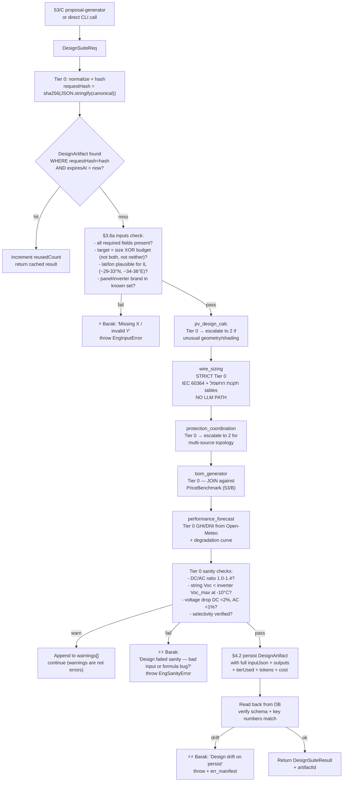

# `[[Engineering_Agent_LLD]]` — Wave 54 · The PV-engineering brain

> Fifth LLD under `protocol_hive.md §7`. This wraps the 6 pre-existing sub-skill specs (`sub-skills/*.md`) in the canonical §7 shape so the agent is callable as a single contract from Wave 53/B (procurement) and Wave 53/C (proposals).
>
> **Why this LLD exists separate from the spine:** the engineering-agent is the only specialist that Barak personally does all of today (audit §A1 — bottleneck). It's the BEE moat. Encoding it correctly is a higher-stakes design than the data plumbing in Wave 53 — a wrong cable size in `wire_sizing` could literally start a fire. This LLD makes the contract explicit and the verification mandatory.

---

## § 1 — Obsidian node header

- **Node:** `[[Engineering_Agent_LLD]]`
- **Inbound (callers):**
  - `[[Wave_53_Unified_Data_Spine]]` (parent)
  - `[[protocol_hive]]` §2 (Tiers), §3.6a (don't invent inputs), §4.2 (validation), §7 (LLD shape)
  - `[[Barak_Skills_Audit]]` §A1 — engineering is the irreplaceable Core Skill #1 and the bottleneck
  - `[[Proposal_Generator_LLD]]` (Wave 53/C) §3.2 — calls all 5 design sub-skills to populate `Proposal.designJson` / `bomJson` / `forecastJson`
  - `[[Procurement_Tracking_LLD]]` (Wave 53/B) §3 — `bom_generator` reads `PriceBenchmark` from procurement
  - `[[Tender_Agent_LLD]]` — same engine for tender RFP responses (different template, same design depth)
  - SolarEdge / Sungrow / SMA / Deye / KStar fleet data feeds `fault_analysis`
- **Sub-skill specs (referenced, not duplicated here):**
  - [`sub-skills/pv_design_calc.md`](sub-skills/pv_design_calc.md)
  - [`sub-skills/wire_sizing.md`](sub-skills/wire_sizing.md)
  - [`sub-skills/protection_coordination.md`](sub-skills/protection_coordination.md)
  - [`sub-skills/bom_generator.md`](sub-skills/bom_generator.md)
  - [`sub-skills/performance_forecast.md`](sub-skills/performance_forecast.md)
  - [`sub-skills/fault_analysis.md`](sub-skills/fault_analysis.md)
- **Outbound:**
  - `[[knowledge-base/il-pv-grid-connection]]` — handover docs generated here cite the בודק forms
  - `[[knowledge-base/il-electrical-code]]` (open) — wire_sizing + protection cite תקנות החשמל
  - `[[knowledge-base/il-solar-regulation]]` — performance_forecast cites monei-neto tariffs
  - `[[BEE Operations app]]` — writes `Job.designSpec` / `Job.electricalPlan` / `Site.productionForecast`
  - `[[engineering-reports]]` — generated PDFs land in this dir, signed by בודק (Barak via mother's license until 2027)

---

## § 2 — Cost / swarm / plugin allocation

### Per sub-skill tier assignment

| Sub-skill | Default tier | Escalation tier | Justification |
|---|---|---|---|
| `pv_design_calc` | **0** (deterministic sizing formulas + lookup tables for inverter specs) | **2** (Sonnet) for non-standard roofs/shading/asymmetric arrays | Most residential + commercial < 100kWp is formula-driven; reasoning only when geometry breaks normal patterns |
| `wire_sizing` | **0** (IEC 60364 formulas + תקנות החשמל cable tables) | none — Tier 0 is the law here | Cable sizing IS deterministic by code. NO LLM allowed in this path (§4.2 below) |
| `protection_coordination` | **0** (selectivity tables + IEC 60898/60947 ratings) | **2** for complex topologies with multiple inverters / battery / generator | Standard radial topology is formulaic; mixed-source coordination needs reasoning |
| `bom_generator` | **0** (lookup from `PriceBenchmark` 53/B + Excel pricebook fallback) | **1** (DeepSeek flash) only when item description is ambiguous | Pure data join — the LLM only helps when supplier called something different than canonical |
| `performance_forecast` | **0** (Open-Meteo GHI/DNI + PVsyst-style irradiation formulas + degradation table) | **1** for shading models (vision over site photos) | Tier 0 covers >90% of cases; vision is the upgrade path |
| `fault_analysis` | **1** (DeepSeek pro reasoning over SolarEdge/Sungrow/SMA telemetry + ladder of common failures) | **2** (Sonnet) for novel symptoms not in the failure ladder | Almost always reasoning over data; rarely needs the deepest model |
| **Orchestrator** (this LLD's runtime) | **0** | none | Pure routing + caching |

**Tier 4 (Opus)** is for *designing* this agent — never for runtime. Once a sub-skill is built it runs at ≤ Tier 2.

### Why this matters

`wire_sizing` and `protection_coordination` are the steps where an LLM hallucinating could cause physical harm. Both are **strictly Tier 0** with reference tables from תקנות החשמל + IEC. The orchestrator REFUSES to escalate them to LLM tiers — it returns an error and asks Barak to do the calculation manually if the standard formulas don't apply. This is encoded in `§4.2` below.

### Plugins / packages

```
# REUSED from Wave 53 spine
prisma, @prisma/client, zod, date-fns, openai (DeepSeek), anthropic (Sonnet)

# NEW for engineering depth
mathjs                # safe expression evaluator for engineering formulas (no eval)
@turf/turf            # GIS for site geometry (lat/lon → bearing, area, distance)
solar-calculator      # Sun position / GHI estimates (or custom — Open-Meteo is already integrated)
nrel-pvwatts (optional)  # NREL PVWatts API as a sanity-check alternative to local formulas — DEFER

# Reference tables (committed in repo, NOT computed)
tables/cable-il.json              # IL/IEC cable ampacity by cross-section / temperature / install method
tables/breaker-curves.json        # MCB B/C/D characteristics
tables/inverter-specs.json        # Per-model Voc/Vmpp/Isc/efficiency/MPPT for SE/Sungrow/SMA/KStar/Deye
tables/panel-specs.json           # Per-model Pmax/Voc/Isc/temp coefficient
```

### Env / secrets

| Name | Source | Used for |
|---|---|---|
| `DEEPSEEK_API_KEY`, `ANTHROPIC_API_KEY` | shared | escalation tiers |
| `OPEN_METEO_BASE_URL` | config | irradiation queries (Open-Meteo is keyless) |
| `ENG_REFERENCE_TABLES_DIR` | config (default `./tables/`) | the JSON tables loaded at boot |
| `ENG_CACHE_TTL_SECONDS` | config (default `86400`) | DesignArtifact cache TTL (24h) |

---

## § 3 — Core LLD + data flow

### 3.1 The contract — one entry per call

```typescript
// engineering-agent/types.ts

/** Anything callable from outside MUST go through this interface. */
export interface EngineeringAgent {
  // 5 design sub-skills, called individually or chained
  pvDesignCalc(req: PvDesignReq): Promise<PvDesignResult>;
  wireSizing(req: WireSizingReq): Promise<WireSizingResult>;
  protectionCoordination(req: ProtectionReq): Promise<ProtectionResult>;
  bomGenerator(req: BomReq): Promise<BomResult>;
  performanceForecast(req: ForecastReq): Promise<ForecastResult>;

  // Diagnostic sub-skill (separate flow — no design output, only analysis)
  faultAnalysis(req: FaultAnalysisReq): Promise<FaultAnalysisResult>;

  // Convenience chain that 53/C calls
  designSuite(req: DesignSuiteReq): Promise<DesignSuiteResult>;
}

export interface DesignSuiteReq {
  /** Site context — IF any required field is missing, §3.6a halts */
  site: {
    addressLine: string;
    lat: number;
    lon: number;
    roofType: "flat" | "tile" | "metal-standing-seam" | "metal-trapezoidal" | "ground";
    usableAreaM2: number;
    azimuthDeg: number;          // 180 = south (IL)
    tiltDeg: number;
    shadingFactor: number;       // 0..1, 0 = none
    annualConsumptionKwh?: number;
  };
  target: {
    sizeKwp?: number;            // EITHER size or budget — never both nor neither
    budgetCents?: bigint;
  };
  customer: {
    id: string;
    tier: "standard" | "enterprise-large" | "enterprise-strategic" | "one-off";
  };
  preferences?: {
    inverterBrand?: "SolarEdge" | "Sungrow" | "SMA" | "KStar" | "Deye";
    panelBrand?: string;
    includeBattery?: boolean;
  };
}

export interface DesignSuiteResult {
  design: PvDesignResult;
  wireSizing: WireSizingResult;
  protection: ProtectionResult;
  bom: BomResult;
  forecast: ForecastResult;
  artifactId: string;                       // FK to DesignArtifact (cache + audit)
  warnings: string[];                       // Tier 0 sanity warnings (e.g. DC/AC ratio > 1.4)
  shaamRequired: boolean;                   // total > SHAAM threshold → flag for 53/C
}
```

### 3.2 Schema diff (Prisma)

```prisma
// One row per generated design — both cache (same brief twice = no recompute)
// and audit (which sub-skill versions produced which numbers when?).

model DesignArtifact {
  id              String   @id @default(cuid())
  requestHash     String   @unique               // sha256 of normalized DesignSuiteReq
  customerId      String

  // Resolved inputs (canonical, for audit)
  inputJson       Json

  // Sub-skill outputs (any combination — single-skill calls also persist)
  pvDesignJson    Json?
  wireSizingJson  Json?
  protectionJson  Json?
  bomJson         Json?
  forecastJson    Json?
  faultAnalysisJson Json?

  // Versioning — let us re-run only changed sub-skills if formulas evolve
  pvDesignVersion       String?              // e.g. "1.2.0" of pv_design_calc spec
  wireSizingVersion     String?
  protectionVersion     String?
  bomVersion            String?              // bumps when PriceBenchmark snapshot changes
  forecastVersion       String?

  // Provenance
  tierUsed        Json                       // {pvDesignCalc: 0, fault_analysis: 2, ...}
  totalTokenIn    Int      @default(0)
  totalTokenOut   Int      @default(0)
  estCostCents    Int      @default(0)       // rough cost estimate for audit

  // Validation circuit (§4.2)
  validatedAt     DateTime?
  validationLog   Json?                      // per-step validation results

  // Cache + audit
  createdAt       DateTime @default(now())
  expiresAt       DateTime                   // ENG_CACHE_TTL_SECONDS after creation
  reusedCount     Int      @default(0)       // how many times served from cache

  @@index([customerId, createdAt(sort: Desc)])
  @@index([expiresAt])
}
```

### 3.3 Mermaid — orchestrator flow (DesignSuite)



### 3.4 The "no LLM in wire_sizing" rule (the safety gate)

```typescript
// engineering-agent/wire-sizing.ts — STRICT Tier 0
import cableTable from "../tables/cable-il.json" assert { type: "json" };

export async function wireSizing(req: WireSizingReq): Promise<WireSizingResult> {
  // PROTOCOL: no LLM path. If the request can't be answered from tables + formulas,
  // throw — DO NOT escalate to a model.
  const { current, length, ambientTempC, installMethod } = req;

  // Step 1: pick base ampacity row from cable-il.json
  const candidates = cableTable.filter(
    (r) => r.installMethod === installMethod &&
           r.ambientTempC >= ambientTempC,
  );
  if (candidates.length === 0) {
    throw new EngTableMissError(
      `wire_sizing: no cable row matches installMethod=${installMethod} ambientTempC=${ambientTempC} — manual calc required (Barak escalation)`,
    );
  }

  // Step 2: smallest cross-section whose ampacity * derating >= 1.25 * current
  const required = current * 1.25;        // NEC-style margin; IL convention similar
  const fit = candidates
    .sort((a, b) => a.crossSectionMm2 - b.crossSectionMm2)
    .find((r) => r.ampacity * r.deratingFactor >= required);
  if (!fit) {
    throw new EngTableMissError(
      `wire_sizing: required ampacity ${required}A exceeds all rows — manual calc required`,
    );
  }

  // Step 3: voltage drop check
  const resistanceOhmPerKm = fit.resistanceOhmPerKm;
  const vDrop = (2 * current * length * resistanceOhmPerKm) / 1000;
  const vDropPct = (vDrop / req.systemVoltageV) * 100;

  return {
    crossSectionMm2: fit.crossSectionMm2,
    ampacityA: fit.ampacity,
    deratedAmpacityA: fit.ampacity * fit.deratingFactor,
    voltageDropV: vDrop,
    voltageDropPct: vDropPct,
    sourceCitation: `cable-il.json row ${fit.id} — תקנות החשמל ${fit.standardRef ?? "ת"י 1004"}`,
  };
}
```

**The orchestrator refuses to retry `wireSizing` with an LLM if `EngTableMissError` is thrown.** It instead escalates to Barak with full context — `protocol_hive §3.6a` applied to engineering correctness.

### 3.5 Validation circuit (§4.2 applied to engineering)

After every `designSuite()` call, before returning:

1. **Cross-skill consistency** — does the BOM panel count match `pvDesignCalc.panel_count`? Does the inverter capacity in BOM cover the design? Does the wire ampacity cover the inverter AC output?
2. **Numeric drift detection** — re-read the persisted `DesignArtifact`; verify key numbers (totalKwp, totalCents, panel_count) match the in-memory result. Catches a Prisma serialization bug.
3. **Reference-table version pin** — `pvDesignVersion` / etc. are the SHA of the relevant table JSON at compute time. If a later run produces different numbers because a table changed, **a re-run is required, not silently cached**.

Failure of any → throw + `err_manifest` + ⚡⚡ Barak. Never serve a stale or inconsistent design.

### 3.6 Fault-analysis flow (separate from design)

`fault_analysis` is the only sub-skill that runs against **live telemetry** rather than producing a design. Inputs:
- SolarEdge / Sungrow / SMA / Deye monitoring data (last N days)
- Symptom hint (Hebrew, free-text: "המערכת ביישוב X ייצרה חצי מהצפוי השבוע")
- Site context (panel count, inverter model, last service date)

It runs at Tier 1 by default (DeepSeek pro). Output is structured: `probableCauses[]` (each with confidence + suggested check), `recommendedActions[]`, `estRepairCostCents`, `estRepairDurationHours`. Posts a `LedgerEntry` debit to `:Job` only after Barak confirms a repair was performed.

Cited reasoning is mandatory: every probable cause names which telemetry pattern triggered it.

---

## § 4 — Code + run + survive

### 4.1 Orchestrator (atomic)

```typescript
// engineering-agent/orchestrator.ts
import { PrismaClient } from "@prisma/client";
import { createHash } from "node:crypto";
import { pvDesignCalc } from "./skills/pv-design.js";
import { wireSizing } from "./skills/wire-sizing.js";
import { protectionCoordination } from "./skills/protection.js";
import { bomGenerator } from "./skills/bom.js";
import { performanceForecast } from "./skills/forecast.js";
import { acquireLock } from "../bank-receipts/lock.js";
import { logManifest, alertBarak } from "../bank-receipts/survive.js";
import { runSanityChecks, verifyPersisted } from "./validate.js";

const CACHE_TTL_S = parseInt(process.env.ENG_CACHE_TTL_SECONDS ?? "86400", 10);

export async function designSuite(prisma: PrismaClient, req: DesignSuiteReq): Promise<DesignSuiteResult> {
  // §3.6a — validate inputs hard
  validateRequest(req);   // throws EngInputError on any missing/contradictory field

  // Canonical hash
  const canonical = JSON.stringify(normalizeForHash(req), Object.keys(req).sort());
  const requestHash = createHash("sha256").update(canonical).digest("hex");

  // Cache hit?
  const cached = await prisma.designArtifact.findUnique({ where: { requestHash } });
  if (cached && cached.expiresAt > new Date()) {
    await prisma.designArtifact.update({
      where: { id: cached.id },
      data: { reusedCount: { increment: 1 } },
    });
    return reconstructResultFromArtifact(cached);
  }

  const lockKey = `engineering:design:${requestHash}`;
  const lock = await acquireLock(prisma, lockKey, 120);
  if (!lock) {
    // Another worker is computing the same request — short retry
    await new Promise((r) => setTimeout(r, 2000));
    const retry = await prisma.designArtifact.findUnique({ where: { requestHash } });
    if (retry) return reconstructResultFromArtifact(retry);
    throw new Error("engineering: design contention — same hash in flight, retry later");
  }

  try {
    const tierUsed: Record<string, number> = {};
    let tokenIn = 0, tokenOut = 0, costCents = 0;

    const design = await pvDesignCalc(req); tierUsed.pvDesignCalc = design.tierUsed;
    const wiring = await wireSizing(deriveWireReq(design, req));     tierUsed.wireSizing = 0;       // STRICT
    const prot   = await protectionCoordination(deriveProtReq(design, wiring));  tierUsed.protectionCoordination = prot.tierUsed;
    const bom    = await bomGenerator(prisma, deriveBomReq(design, wiring, prot, req.customer)); tierUsed.bomGenerator = bom.tierUsed;
    const fcst   = await performanceForecast(deriveForecastReq(design, req));    tierUsed.performanceForecast = fcst.tierUsed;

    // Tier-0 sanity checks across skills
    const warnings: string[] = [];
    const sanity = runSanityChecks({ design, wiring, prot, bom, fcst });
    warnings.push(...sanity.warnings);
    if (sanity.fatal.length > 0) {
      await alertBarak(`Engineering sanity failed for customer ${req.customer.id}: ${sanity.fatal.join(", ")}`, { urgent: true });
      throw new Error(`engineering_sanity_fatal: ${sanity.fatal.join(",")}`);
    }

    // Persist
    const artifact = await prisma.designArtifact.create({
      data: {
        requestHash, customerId: req.customer.id,
        inputJson: req as any,
        pvDesignJson: design as any, wireSizingJson: wiring as any,
        protectionJson: prot as any, bomJson: bom as any, forecastJson: fcst as any,
        pvDesignVersion: design.version, wireSizingVersion: wiring.version,
        protectionVersion: prot.version, bomVersion: bom.version, forecastVersion: fcst.version,
        tierUsed: tierUsed as any,
        totalTokenIn: tokenIn, totalTokenOut: tokenOut, estCostCents: costCents,
        expiresAt: new Date(Date.now() + CACHE_TTL_S * 1000),
      },
      select: { id: true },
    });

    // §4.2 read-back
    const verified = await verifyPersisted(prisma, artifact.id, { design, wiring, prot, bom, fcst });
    if (!verified.ok) {
      await logManifest({ kind: "engineering_persist_drift", root_cause: verified.reason, context: { artifactId: artifact.id, customerId: req.customer.id } });
      await alertBarak(`Design persist drift for customer ${req.customer.id}: ${verified.reason}`, { urgent: true });
      throw new Error("engineering_persist_drift");
    }
    await prisma.designArtifact.update({ where: { id: artifact.id }, data: { validatedAt: new Date(), validationLog: verified as any } });

    const shaamThreshold = await getShaamThresholdNow(prisma);    // from knowledge-base/il-einvoicing-shaam
    const shaamRequired = bom.totalCents >= shaamThreshold;

    return { design, wireSizing: wiring, protection: prot, bom, forecast: fcst, artifactId: artifact.id, warnings, shaamRequired };

  } catch (e: any) {
    await logManifest({ kind: "engineering_throw", root_cause: e.message ?? String(e), context: { requestHash, customerId: req.customer.id } });
    throw e;
  } finally {
    await lock.release().catch(() => undefined);
  }
}
```

### 4.2 Install + healthcheck

```bash
#!/usr/bin/env bash
# engineering-agent/install.sh
set -euo pipefail
npm install mathjs @turf/turf
# Reference tables must be present
for t in cable-il.json breaker-curves.json inverter-specs.json panel-specs.json; do
  [[ -f "./tables/$t" ]] || { echo "missing table: $t"; exit 1; }
done
npx prisma migrate dev --name engineering_v1
echo "Engineering agent v1 ready"
```

```typescript
// engineering-agent/healthcheck.ts
const recent = await prisma.designArtifact.findMany({
  where: { createdAt: { gt: new Date(Date.now() - 7*86400_000) } },
  orderBy: { createdAt: "desc" }, take: 10,
});
const failureRate = await prisma.ingestRun.count({
  where: { pipeline: "engineering", status: "fail", startedAt: { gt: new Date(Date.now() - 7*86400_000) } },
});
console.log(JSON.stringify({
  last7d: { runs: recent.length, validated: recent.filter((r) => r.validatedAt).length, failures: failureRate, avgReuse: avg(recent.map((r) => r.reusedCount)) },
}));
```

### 4.3 Error path

All `EngInputError` / `EngTableMissError` / `EngSanityError` failures:
1. NOT silently retried at a higher tier (§3.4 rule).
2. Logged to `err_manifest.jsonl` with full request hash + error kind.
3. ⚡ Barak ("urgent" only on sanity/persist drift; "non-urgent" on InputError).
4. Lock released; cache NOT populated.
5. Caller (53/C / 53/B / CLI) receives the typed error and decides UI (53/C halts the proposal draft and shows the error to Barak; CLI exits non-zero).

---

## § 5 — Build phasing

| Phase | Hours | Deliverable | Gate |
|---|---|---|---|
| **A. Schema + reference tables + orchestrator skeleton** | 5h | DesignArtifact migration, 4 JSON tables committed, orchestrator that calls 5 stub sub-skills | Cache round-trip works (hash → store → re-hash → cache hit) |
| **B. wire_sizing (strict Tier 0)** | 5h | Real cable-il.json built from תקנות החשמל; voltage-drop formula; refuses LLM escalation | 10 reference cases match Barak's hand calc within rounding |
| **C. pv_design_calc + sanity checks** | 6h | String-sizing + DC/AC ratio + Voc temperature check | 5 fixture sites (3 res / 2 commercial) match Barak's SketchUp output |
| **D. protection_coordination** | 6h | Breaker selection from breaker-curves.json, selectivity rules, RCD type B | Standard topology + 1 multi-source case validated |
| **E. bom_generator + PriceBenchmark hookup (53/B link)** | 5h | Pulls live supplier prices; markup applied per customer tier | Real proposal end-to-end with current prices, off Excel pricebook |
| **F. performance_forecast + Open-Meteo** | 4h | GHI/DNI per-site, degradation curve, 25y production | 1 real site backtest against actual SolarEdge history (last 12mo) within ±8% |
| **G. fault_analysis (Tier 1 DeepSeek)** | 6h | Symptom → telemetry → probable causes ladder | 3 real past faults BEE solved → agent independently surfaces the same cause |
| **H. designSuite chained orchestrator + 53/C integration** | 4h | One call from 53/C populates designJson/bomJson/forecastJson | First proposal end-to-end uses live engineering output, not stub |
| **I. Validation circuit + cache TTL handling** | 3h | Read-back + drift detection + version pinning | Inject formula bug → drift detected before cache pollutes |

**MVP = A+B+C+D+E = ~27h.** F-I layer on. **G (fault_analysis)** is independent — can ship in parallel.

---

## § 6 — How this couples to the spine

| Touchpoint | Direction | What's exchanged |
|---|---|---|
| Wave 53/B `PriceBenchmark` | input | per-`descriptionNorm` rolling supplier prices → `bom_generator` |
| Wave 53/B `Supplier` | input | supplier id + payment terms → `bom_generator` uses preferred supplier per category |
| Wave 53/C `Proposal*` | output | `designJson` / `bomJson` / `forecastJson` populated by `designSuite()` |
| Wave 53/D `LedgerEntry` (`:Job`) | output | `fault_analysis` repair confirmation triggers debit entry on the job |
| `knowledge-base/il-pv-grid-connection.md` | input | form templates the engineering output cites |
| `knowledge-base/il-electrical-code.md` `[OPEN]` | input | תקנות החשמל reference rows — when filled, `wire_sizing` / `protection_coordination` reference-tables get authoritative source citations |
| BEE Ops app `Job`, `Site`, `Equipment` | bidirectional | reads site context, writes design spec |
| Open-Meteo | external | GHI/DNI for `performance_forecast` |

---

## § 7 — Out of scope (intentional)

- **HV (>1000V AC) engineering.** BEE's commercial fleet today is LV + distribution-level; HV substation design needs Schneider/ABB-grade software and a separate engineer's stamp. Defer.
- **CAD line drawings.** Engineering-agent outputs numbers + parts; the actual electrical drawings stay in SketchUp/AutoCAD with Barak. Future: auto-generate single-line diagram from `pv_design_calc` output — separate LLD.
- **Structural/civil engineering.** Roof load, wind uplift, anchor selection — out of scope; cite consultant.
- **Battery sizing and EMS configuration.** Deye ESS specifically requires its own LLD for SoC strategy / load-shifting; Phase G+ if BEE expands battery business.
- **License sign-off.** The agent generates designs; Barak (currently via mother's בודק license, his own in 2027) signs them. The signature is human, always.

---

## § 8 — Open questions

| # | Question | Blocks |
|---|---|---|
| EA-1 | Authoritative source for `cable-il.json` — is it ת"י 1004 + תקנות החשמל, or do you use a vendor table? | wire_sizing accuracy |
| EA-2 | DC/AC ratio policy — what's BEE's max acceptable? (industry standard 1.2-1.3; some markets push 1.4) | pv_design_calc sanity |
| EA-3 | Preferred inverter per panel kWp range — table from your experience or first-pass try-all? | bom_generator pick |
| EA-4 | Shading model — start with `shadingFactor` scalar (0..1) or skip ahead to per-month decomposition? | performance_forecast depth |
| EA-5 | fault_analysis training set — can you point at 3-5 closed past tickets with the resolution to seed the failure ladder? | G accuracy |

---

*Authored 2026-06-16 by cloud cortex per `protocol_hive.md §7`. The 5th LLD and the brain of the spine. The 6 sub-skill specs (`sub-skills/*.md`) remain authoritative for individual sub-skill behavior; this LLD owns orchestration + safety gates + integration contracts.*
