# `[[Proposal_Generator_LLD]]` — Wave 53/C · Unified Data Spine §3 (emission side)

> Third LLD under `protocol_hive.md §7`. Replaces the current Canva/Word/Excel quote workflow (audit Q3) with a templated engine that pulls live supplier prices (Wave 53/B), engineering output (`engineering-agent`), and customer context (Monday + BEE app). Output: a signed-ready Hebrew RTL PDF + an audit-traced quote record in the BEE app.
>
> **Direction:** while Wave 53/A and 53/B are *ingestion* into the spine, this LLD is *emission* out of it — the spine flips into customer-facing output.

---

## § 1 — Obsidian node header

- **Node:** `[[Proposal_Generator_LLD]]`
- **Inbound:**
  - `[[Wave_53_Unified_Data_Spine]]` (parent — emission branch)
  - `[[protocol_hive]]` §2 (Tiers), §4.2 (Validation), §3.6a (no guessing), §7 (4-section shape)
  - `[[Engineering_Agent_LLD]]` — supplies `pv_design_calc` + `bom_generator` outputs that become the technical core of the proposal
  - `[[Procurement_Tracking_LLD]]` — supplies `PriceBenchmark` + current supplier prices for live BOM costing
  - `[[Bank_Receipts_Ingestion_LLD]]` — supplies customer payment history (informs payment-terms personalization)
  - `[[Barak_Skills_Audit]]` §A2 — "quotes" is one of the 5 items in the burning layer
  - `[[knowledge-base/il-einvoicing-shaam]]` — proposal becomes invoice → SHAAM compliance baked in upfront
- **Outbound:**
  - `[[Customer_Success_Agent_LLD]]` — proposals fed back as a touchpoint
  - `[[Tender_Agent_LLD]]` — same engine generates tender bid documents (different template, same core)
  - `[[Cash_Flow_Snapshot]]` — pending-quote pipeline forecast feeds in
  - Monday "Deals" board — proposals attach to a Monday card
  - Customer (via Gmail + WhatsApp) — final emission target

---

## § 2 — Cost / swarm / plugin allocation

### Per-step tier assignment

| Step | Tier | Engine | Justification |
|---|---|---|---|
| 1. Capture proposal brief (form / WA / email / voice) | **0** | Existing Alfred intake | Plumbing |
| 2. Normalize brief into structured `:ProposalRequest` | **1** | DeepSeek flash + Zod | Extract size_kWp / location / roof type / budget hints |
| 3. Resolve `:Customer` (fuzzy match or new) | **0** | pg_trgm | §3.4 reuse |
| 4. Call `engineering-agent.pv_design_calc` | **1-2** | DeepSeek pro | Reasoning over modules/inverters/strings |
| 5. Call `engineering-agent.wire_sizing` + `protection_coordination` | **0-1** | mostly deterministic | Per protocol §2 Tier 0 |
| 6. Call `engineering-agent.bom_generator` | **0** | Lookup from `Supplier` + `PriceBenchmark` (Wave 53/B) | Pure data join |
| 7. Call `engineering-agent.performance_forecast` | **1** | DeepSeek flash | kWh/year estimate per site (lat/lon + tilt + shading) |
| 8. Pricing engine: BOM cost + markup tier + payment plan | **0** | SQL + pricing rules | Deterministic — markup table lives in BEE app |
| 9. Generate Hebrew RTL proposal document | **0** | docx → PDF template engine | NO LLM in final render — every word is approved upfront |
| 10. Customer-personalization paragraphs (optional) | **2** | Claude Sonnet | Tone match if Barak has prior comms (Hebrew nuance) |
| 11. Compliance pre-check: SHAAM, terms, warranty | **0** | Rule-based gate | Block if anything missing |
| 12. Output: PDF + Monday attachment + DB record + ⚡ Barak for approval | **0** | I/O | Plumbing |
| 13. Send-to-customer (after Barak approves) | **0** | Gmail / WA | Constitutional law #1: only Barak can send to customer; system stages, never auto-sends |

**Tier 4 only at architecture time.** Runtime stays ≤ Tier 2.

### Plugins / packages

```
# REUSED from Wave 53/A+B
prisma, @prisma/client, zod, date-fns, openai (DeepSeek), ioredis (locks)

# NEW for proposal generation
docx                  # docxtemplater or @docxjs/docx — Hebrew RTL templates
libreoffice (CLI)     # docx -> PDF on bee-prod-1 (headless); Windows fallback uses MS Word COM
pdf-lib               # final stamping (digital signature placeholder, watermarks)
sharp                 # site photo handling (cover image, thumbnails)
```

### Env / secrets

| Name | Source | Used for |
|---|---|---|
| `DATABASE_URL`, `REDIS_URL`, `DEEPSEEK_API_KEY`, `ANTHROPIC_API_KEY` | shared | Wave 53/A+B reused; Sonnet for personalization step |
| `PROPOSAL_TEMPLATE_DIR` | secrets / config | path to .docx templates (residential / commercial / tender variants) |
| `PROPOSAL_OUTPUT_DIR` | config | where rendered PDFs go (synced to Drive) |
| `LIBREOFFICE_PATH` | config | `/usr/bin/soffice` on bee-prod-1; on Windows: `C:\Program Files\LibreOffice\program\soffice.exe` |
| `BARAK_SIGNATURE_IMG` | secrets | digital signature PNG (already exists in BEE assets repo as logo source) |

---

## § 3 — Core LLD + data flow

### 3.1 Schema diff (Prisma)

```prisma
// Add to BEE app's schema.prisma — diff only.
// Builds on Wave 53/A (Bank*) + Wave 53/B (Supplier*, PurchaseOrder*).

model ProposalRequest {
  id              String   @id @default(cuid())
  customerId      String?                                      // null if new lead (resolves later)
  customerHint    String?                                      // raw name from brief
  source          String                                       // 'manual' | 'wa' | 'email' | 'monday' | 'voice'
  sourceRefId     String?                                      // gmail msg id / wa msg id / monday item id
  briefRaw        String   @db.Text                            // original text
  briefStructured Json?                                        // normalized output of step 2
  siteAddress     String?
  siteLat         Float?
  siteLon         Float?
  targetSizeKwp   Float?
  budgetHintCents BigInt?
  status          String                                       // 'open' | 'designing' | 'priced' | 'drafted' | 'sent' | 'won' | 'lost' | 'expired'
  createdAt       DateTime @default(now())
  updatedAt       DateTime @updatedAt

  proposals       Proposal[]

  @@unique([source, sourceRefId])
  @@index([status])
  @@index([customerId])
}

model Proposal {
  id              String   @id @default(cuid())
  requestId       String
  request         ProposalRequest @relation(fields: [requestId], references: [id])

  version         Int      @default(1)                         // revisions of the same proposal
  status          String                                       // 'draft' | 'awaiting-approval' | 'approved' | 'sent' | 'accepted' | 'rejected' | 'expired'

  // Engineering output (reference, not duplicate)
  designJson      Json                                         // pv_design_calc result snapshot
  bomJson         Json                                         // bom_generator snapshot at time of proposal
  forecastJson    Json                                         // performance_forecast snapshot

  // Commercial
  subtotalCents   BigInt
  markupPct       Float                                        // resolved from CustomerTier × project type
  totalBeforeVatCents BigInt
  vatCents        BigInt
  totalCents      BigInt
  paymentPlanJson Json                                         // milestones

  // Outputs
  docxPath        String?
  pdfPath         String?
  pdfSha256       String?                                      // tamper detection
  templateName    String                                       // 'residential' | 'commercial' | 'tender' | ...

  // Compliance pre-check
  shaamFlagged    Boolean  @default(false)                     // total >= SHAAM threshold?
  complianceNotes String?

  validFrom       DateTime
  validUntil      DateTime

  // Workflow
  draftedAt       DateTime @default(now())
  approvedByBarakAt DateTime?
  sentAt          DateTime?
  sentVia         String?                                      // 'gmail' | 'wa' | 'manual'
  acceptedAt      DateTime?
  rejectedAt      DateTime?
  rejectionReason String?

  // Monday + audit
  mondayItemId    String?
  rawGenerationLog String? @db.Text                            // tier-1 LLM prompts + responses (for §4.2 audit)

  @@unique([requestId, version])
  @@index([status, validUntil])
}

model ProposalTemplate {
  id              String   @id @default(cuid())
  name            String   @unique                             // 'residential' | 'commercial' | 'tender'
  language        String   @default("he")                      // 'he' | 'en'
  docxPath        String
  description     String?
  active          Boolean  @default(true)
  createdAt       DateTime @default(now())
}

model CustomerTier {
  id              String   @id @default(cuid())
  name            String   @unique                             // 'standard' | 'enterprise-large' | 'enterprise-strategic' | 'one-off'
  defaultMarkupPct Float
  paymentTermsDays Int                                          // default net-N for invoices
  shaamPreApproved Boolean @default(false)                     // certain enterprise customers we always SHAAM-stamp
}
```

### 3.2 Mermaid — full pipeline with all gates

```mermaid
flowchart TD
  brief["Brief in:<br/>WhatsApp / Gmail / voice memo / Monday card / manual form"]
  brief --> normalize["Tier 1: structure brief<br/>(size_kWp, location, roof, budget hint)<br/>DeepSeek + Zod schema"]
  normalize --> resolve{":Customer resolve<br/>fuzzy match or new"}
  resolve -->|new| watchlist["§3.6a: stage Customer as 'lead'<br/>do NOT auto-promote"]
  resolve -->|matched| customer["Resolved :Customer + tier"]

  watchlist --> req
  customer --> req
  req["Create :ProposalRequest status='open'"]

  req --> engr["engineering-agent suite:<br/>1. pv_design_calc<br/>2. wire_sizing<br/>3. protection_coordination<br/>4. bom_generator (pulls Wave 53/B prices)<br/>5. performance_forecast"]

  engr --> pricing["Tier 0 pricing engine:<br/>BOM × markup tier × payment plan<br/>+ SHAAM threshold check"]

  pricing --> persona{"Customer has prior comms?"}
  persona -->|yes| sonnet["Tier 2: Sonnet personalization<br/>(opener + closer in Barak's tone)"]
  persona -->|no| nopersona["Use neutral template wording"]

  sonnet --> compliance
  nopersona --> compliance

  compliance{"Compliance pre-check<br/>SHAAM · warranty · terms · validity"}
  compliance -->|fail| blockalert["⚡⚡ Barak: missing X — fix template<br/>halt"]
  compliance -->|pass| render

  render["docxtemplater: render Hebrew RTL .docx<br/>NO LLM in final render — every variable is approved data"]
  render --> pdf["libreoffice --headless --convert-to pdf<br/>+ pdf-lib stamp + sha256"]

  pdf --> stage["Stage to :Proposal status='awaiting-approval'<br/>attach to Monday card"]
  stage --> alert["⚡ Barak: 'Proposal v1 ready for X — review at <link>'"]

  alert --> barak{"Barak reviews"}
  barak -->|approve| approved["status='approved'<br/>create-or-rev"]
  barak -->|edit| rev["Rev v2 with edits<br/>back to render"]

  approved --> send{"Send via?"}
  send -->|Gmail| gmail["Send PDF + Hebrew body via Gmail OAuth"]
  send -->|WA| wa["Send PDF via WhatsApp (Alfred dispatchSend)"]
  send -->|manual| manual["Barak sends himself · system only marks 'sent'"]

  gmail --> sent["status='sent' + sentAt + sentVia"]
  wa --> sent
  manual --> sent

  sent --> followup["7d / 14d / 21d follow-up reminders<br/>(customer-success-agent territory)"]
  sent --> validity["At validUntil: if status='sent', flip to 'expired' + ⚡ Barak"]
```



### 3.3 Constitutional gates

- **Law #1 (4 destinations):** the system **never auto-sends to a customer**. It stages and ⚡s Barak. The send call only fires after `Proposal.approvedByBarakAt` is set. Both Gmail send and WA send go through `dispatchSend()` which enforces the 4-destinations rule (self / drafts group / transcripts group / Neri sync), with the customer chat exempted ONLY when carrying an `approvedProposalId`.
- **§3.6a (no guessing):** if any required input is missing (`siteAddress`, `targetSizeKwp`, regulatory category) the engine stops and ⚡s Barak instead of inventing.
- **§4.2 (validation circuit):** after rendering, `pdf-lib` re-parses the PDF and verifies every numeric value still matches the staged `Proposal.*Cents` fields. If a templating bug introduced a typo, render fails loudly.

### 3.4 Hebrew RTL templating notes

Critical because LibreOffice's RTL handling is good but template authoring is tricky.

- Templates are authored in MS Word (Barak's tool) → committed under `templates/`.
- Variables use `{$variable}` syntax via docxtemplater.
- Numbers in Hebrew docs: align right, format `1,234.56 ₪` with the `₪` after the number.
- Bidi mixed runs (English part numbers inside Hebrew sentences): wrap in `<w:r dir="ltr">` blocks (docxtemplater module).
- Page footer carries: `BEE • ע.מ 123456789 • [page] / [pageCount]`.

### 3.5 Template variants (versioned in repo)

| Template | When used | Key sections |
|---|---|---|
| `residential.docx` | <15kWp customer, simple roof | Cover · scope · BOM · price · payment · warranty · signatures |
| `commercial.docx` | 15-630kWp, multi-meter, מסחרי customer | Adds: HV diagrams ref · protection scheme · production forecast · monitoring SLA · grid-connection plan |
| `tender.docx` | Public/private RFP responses | Formal Hebrew · company profile · references · compliance matrix · price-only annex |
| `service.docx` (later) | O&M service contracts | Different shape — defer to Phase E |

---

## § 4 — Code + run + survive

### 4.1 Core generator (atomic flow)

```typescript
// proposals/generate.ts
import { PrismaClient } from "@prisma/client";
import { acquireLock } from "../bank-receipts/lock.js";
import { alertBarak, logManifest } from "../bank-receipts/survive.js";
import { structureBrief } from "./brief.js";
import { resolveOrStageCustomer } from "./customers.js";
import { runEngineering } from "./engineering.js";              // wraps engineering-agent calls
import { priceWithMarkup } from "./pricing.js";
import { renderDocx, docxToPdf, stampPdf } from "./render.js";
import { personalize } from "./persona.js";
import { complianceCheck } from "./compliance.js";

export async function generateProposal(prisma: PrismaClient, opts: { requestId: string; templateName: string; dryRun?: boolean }) {
  const lockKey = `proposal:request:${opts.requestId}`;
  const lock = await acquireLock(prisma, lockKey, 900);
  if (!lock) return { skipped: { reason: "locked" } };

  const run = await prisma.ingestRun.create({
    data: { pipeline: "proposal-generator", sourceMode: "internal", status: "running" },
  });

  try {
    const req = await prisma.proposalRequest.findUniqueOrThrow({
      where: { id: opts.requestId }, include: { /* customer if linked */ },
    });

    // Step 4-7: Engineering suite
    const eng = await runEngineering(prisma, req);     // throws if missing data; §3.6a

    // Step 8: Pricing
    const price = await priceWithMarkup(prisma, req.customerId, eng.bom);

    // Step 10: Personalization (optional)
    const tone = req.customerId ? await personalize(prisma, req.customerId) : null;

    // Step 11: Compliance pre-check
    const comp = await complianceCheck({ totalCents: price.totalCents, req, eng });
    if (!comp.ok) {
      await alertBarak(`Proposal ${opts.requestId}: blocked — ${comp.reasons.join(", ")}`, { urgent: true });
      throw new Error(`compliance_block: ${comp.reasons.join(",")}`);
    }

    // Find or create version
    const lastVer = await prisma.proposal.findFirst({
      where: { requestId: req.id }, orderBy: { version: "desc" }, select: { version: true },
    });
    const version = (lastVer?.version ?? 0) + 1;

    // Stage the row BEFORE rendering — so we can audit even on render failure
    const proposal = await prisma.proposal.create({
      data: {
        requestId: req.id, version, status: "draft",
        templateName: opts.templateName,
        designJson: eng.design, bomJson: eng.bom, forecastJson: eng.forecast,
        subtotalCents: price.subtotalCents, markupPct: price.markupPct,
        totalBeforeVatCents: price.totalBeforeVatCents, vatCents: price.vatCents, totalCents: price.totalCents,
        paymentPlanJson: price.paymentPlan,
        shaamFlagged: comp.shaamRequired,
        validFrom: new Date(),
        validUntil: new Date(Date.now() + 30 * 86400_000),    // 30d validity default
      },
      select: { id: true },
    });

    if (opts.dryRun) {
      await prisma.proposal.delete({ where: { id: proposal.id } });
      return { runId: run.id, dryRun: true, computed: { totalCents: price.totalCents, eng, comp } };
    }

    // Render
    const docxPath = await renderDocx(opts.templateName, { req, eng, price, tone, proposal });
    const pdfPath = await docxToPdf(docxPath);
    const stamped = await stampPdf(pdfPath);   // returns { path, sha256 }

    // §4.2 validation: re-parse PDF, verify totals
    const verified = await verifyPdfNumbers(stamped.path, price);
    if (!verified.ok) {
      await logManifest({ kind: "proposal_render_drift", runId: run.id, stream: "proposals",
                         root_cause: "PDF totals differ from staged DB row",
                         context: { proposalId: proposal.id, diffs: verified.diffs } });
      await alertBarak(`Proposal ${proposal.id}: PDF numbers don't match DB. Halting.`, { urgent: true });
      throw new Error("render_validation_failed");
    }

    await prisma.proposal.update({
      where: { id: proposal.id },
      data: { docxPath, pdfPath: stamped.path, pdfSha256: stamped.sha256, status: "awaiting-approval" },
    });

    await alertBarak(`Proposal v${version} ready for ${req.customerHint ?? req.customerId}: ₪${price.totalCents/100n} — review: ${stamped.path}`);

    await prisma.ingestRun.update({ where: { id: run.id }, data: { finishedAt: new Date(), status: "ok", rowsInserted: 1 } });
    return { runId: run.id, proposalId: proposal.id, pdfPath: stamped.path };

  } catch (e: any) {
    await prisma.ingestRun.update({ where: { id: run.id }, data: { finishedAt: new Date(), status: "fail", errorCode: e.code ?? "unknown", errorMessage: String(e).slice(0, 500) } });
    await logManifest({ kind: "proposal_throw", runId: run.id, stream: "proposals", root_cause: e.message ?? String(e), context: { requestId: opts.requestId } });
    await alertBarak(`Proposal generation FAILED for request ${opts.requestId}: ${e.message ?? String(e)}`, { urgent: true });
    throw e;
  } finally {
    await lock.release().catch(() => undefined);
  }
}
```

### 4.2 Send-to-customer gate (separate function, explicit Barak approval)

```typescript
// proposals/send.ts — CANNOT be called without an approved proposal
export async function sendProposal(prisma: PrismaClient, opts: { proposalId: string; via: "gmail" | "wa" }) {
  const p = await prisma.proposal.findUniqueOrThrow({ where: { id: opts.proposalId } });
  if (!p.approvedByBarakAt) {
    throw new Error("CONSTITUTIONAL_BLOCK: proposal not approved by Barak — cannot send");
  }
  // dispatchSend() enforces 4-destinations rule + allows customer recipient ONLY with valid approvedProposalId
  await dispatchSend({ kind: "proposal", proposalId: p.id, via: opts.via });
  await prisma.proposal.update({ where: { id: p.id }, data: { status: "sent", sentAt: new Date(), sentVia: opts.via } });
}
```

### 4.3 Install + healthcheck

```bash
# proposals/install.sh
#!/usr/bin/env bash
set -euo pipefail
npm install docx docxtemplater pdf-lib sharp
# LibreOffice
if ! command -v soffice >/dev/null 2>&1; then
  if [[ "$OSTYPE" == "linux-gnu"* ]]; then sudo apt-get install -y libreoffice; 
  else echo "Install LibreOffice manually on Windows from libreoffice.org"; fi
fi
npx prisma migrate dev --name proposals_v1
# Verify
node -e "
const { execFileSync } = require('node:child_process');
console.log('soffice:', execFileSync('soffice', ['--version']).toString().trim());
"
```

```typescript
// healthcheck.ts
const stats = await prisma.proposal.groupBy({ by: ["status"], _count: true });
const expiringSoon = await prisma.proposal.count({
  where: { status: "sent", validUntil: { lt: new Date(Date.now() + 7*86400_000) } },
});
console.log(JSON.stringify({ stats, expiringSoon }));
```

### 4.4 Error path (PROTOCOL §4.4)

Same shape as Wave 53/A+B: structured run row, `err_manifest.jsonl`, `alertBarak`, lock release in `finally`. **Critical difference:** if rendering fails midway, the staged `:Proposal` row is left in `status='draft'` with `pdfPath=null` for human inspection. We do NOT auto-delete — Barak should see what was attempted.

---

## § 5 — Build phasing

| Phase | Hours | Deliverable | Gate |
|---|---|---|---|
| **A. Schema + 1 template + dry-run path** | 6h | Prisma migration, residential.docx + render pipeline, all syntax checks green, dry-run produces valid PDF on fixture brief | Render a fixture brief end-to-end, PDF numbers match staged row |
| **B. Pricing engine + compliance check** | 5h | Markup tiers, SHAAM threshold gate, payment plan generator | Inject above-SHAAM brief → flagged |
| **C. Brief structuring (Tier 1) + new-customer staging** | 4h | DeepSeek + Zod on free-text brief, watchlist gate | Sample WA messages structure correctly; new name → watchlist |
| **D. Engineering-agent integration** | 6h | Wire `pv_design_calc`/`bom_generator`/`performance_forecast` (per engineering SKILL.md spec) | Real brief → real BOM with Wave 53/B prices |
| **E. Personalization + commercial template** | 5h | Sonnet tone-matching from prior customer comms; commercial.docx with HV sections | Side-by-side: same brief, two templates, both render cleanly |
| **F. Approval + send gates** | 4h | Stage→approve→send flow; constitutional law #1 enforcement; PDF tamper detect | Try to send without approval → blocked |
| **G. Tender template + Tender_Agent integration** | 6h | tender.docx + RFP compliance matrix builder | Generate fixture tender response, all required sections present |
| **H. Follow-up + expiry crons** | 3h | 7/14/21d nudges, expiry flip + ⚡ | Old proposal flips to expired on cron |

**MVP = A + B + C = ~15h.** D unlocks the real engineering depth. F is the customer-safety gate.

---

## § 6 — Coupling with the spine

| Wave | Role | Direction |
|---|---|---|
| 53/A bank | reads customer payment history → informs payment-terms personalization | **input** |
| 53/B procurement | reads `Supplier.currentPrices` + `PriceBenchmark` → live BOM costing | **input** |
| `engineering-agent` (phase-3) | calls 5 sub-skills | **input** |
| `customer-success-agent` (phase-3) | consumes `:Proposal` lifecycle events | **output** |
| `tender-agent` (phase-3) | wraps this engine with a different template | **output** |

Pricing + compliance live IN proposals; they don't get duplicated to invoicing. When a proposal is `accepted`, an invoice flow (separate LLD, future) reuses the same data.

---

## § 7 — Out of scope (intentional)

- **Invoice generation.** Different LLD. Triggered when `Proposal.status='accepted'`. Touches Invoice Maven + SHAAM API.
- **Contract drafting.** Legal templating is a separate domain (and lawyer-reviewed); proposals are commercial.
- **Electronic signatures.** PDF signature field placeholder yes, actual signing flow defer.
- **Multilingual proposals (English).** Schema supports `language` field; engine pluggable; templates not authored yet.

---

*Authored 2026-06-15 by cloud cortex per `protocol_hive.md` §7. The third LLD in the Unified Data Spine — first two were ingestion, this one is emission. With this in place: brief → AI orchestration → reviewed Hebrew PDF → Barak ships in one click. Burns when implemented.*
